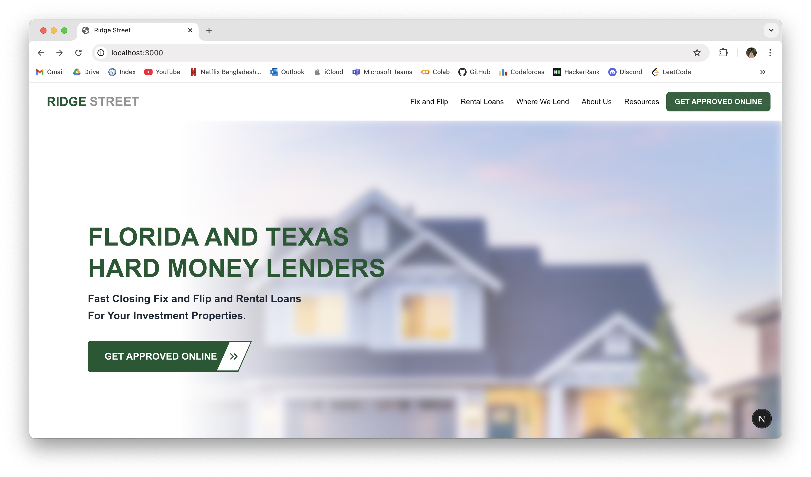
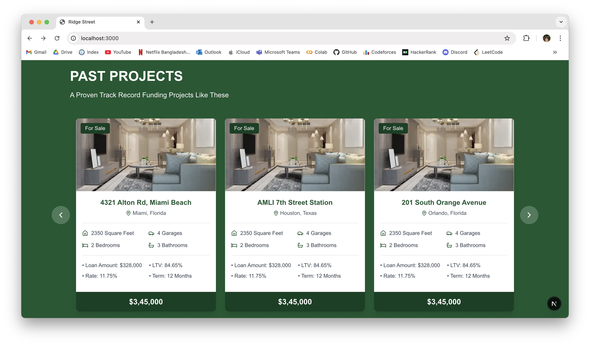
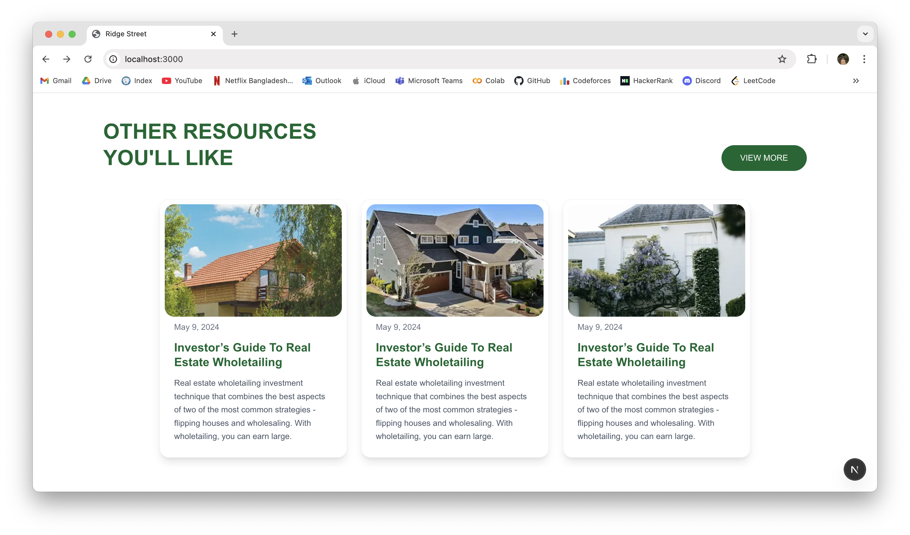

# softvence-assesment

A modern web application for Ridge Street, focused on private mortgage loans and real estate investment solutions. The site features interactive landing, reviews, lending areas, loan products, past projects, and resources sections.

---

## 🚀 Project Setup

1. **Clone the repository:**

   ```bash
   git clone https://github.com/ashrafulatif/softvence-assesment.git
   cd softvence-assesment
   ```

2. **Install dependencies:**

   ```bash
   npm install

   ```

3. **Run the development server:**

   ```bash
   npm run dev

   ```

4. **Open in browser:**
   ```
   http://localhost:3000
   ```

---

## 🛠️ Tools & Packages Used

- **Framework:** Next.js
- **Styling:** Tailwind CSS, PostCSS
- **Linting:** ESLint (`next/core-web-vitals`)
- **Icons:** lucide-react
- **Fonts:** Geist, Geist_Mono (Google Fonts)
- **Image Handling:** next/image (supports Unsplash, daisyui remote images)
- **Component Structure:** React functional components
- **Custom UI:** CustomButton, CustomButton2
- **Data Files:** JSON files for projects, reviews, resources

---

## 📸 Screenshots

Landing page features sections such as:

- Hero banner
- Loan products (Fix and Flip, Rental Loans, etc.)
- Lending states (focus on Texas and Florida)
- Past projects gallery
- Client reviews
- Resource cards

### Example Components

#### Hero and Get Started Section



#### Past Projects Section

Each project card displays property images with details.


#### Resource Cards

Resource section cards display images and descriptions.



---

## 📂 Structure

- `src/components/`: Reusable components (Hero, Navbar, Footer, ProjectCard, ReviewCard, etc.)
- `src/app/`: App layout and pages
- `src/data/`: JSON files for dynamic data (projects, reviews, resources)
- `public/`: Static assets (images, icons)

---

## ✨ Features

- Responsive design with Tailwind CSS
- Dynamic sections powered by JSON data
- Modern UI components for quick navigation and interaction
- Easy customization for branding and content

---

## 📧 Contact

For questions, reach out to [ashrafulatif](https://github.com/ashrafulatif).
